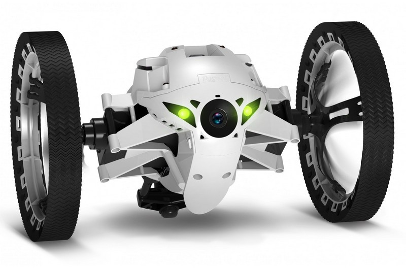
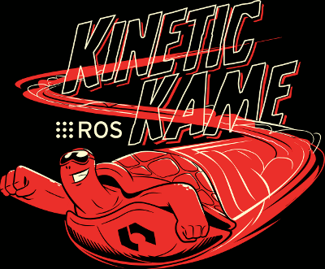

# rossumo

[](https://travis-ci.org/arnaud-ramey/rossumo)

<p align="center">


</p>

Description
===========

"rossumo" is a driver to use the
[Jumping Sumo](https://store.parrot.com/uk/jumping-sumo/112-jumping-sumo.html) robot, built by Parrot,
in [ROS](http://www.ros.org/).
It relies on
[ARDroneSDK3](http://developer.parrot.com/docs/bebop/?c#general-information),
the official Parrot SDK.
It is written in C++.

This version is compatible with ARDroneSDK3 version 3.1.0.13
(it can be checked in
``"packages/libARCommands/Includes/libARCommands/ARCOMMANDS_Version.h"```.

Unfortunately, Parrot developers change many files at each release of ARDroneSDK3,
most notably ```"libARController/ARCONTROLLER_Dictionary.h"```.
For this reason, it cannot be ensured that `rossumo` is compatible
with later versions of ARDroneSDK3.

Supported hardware
==================

The library was developed for the original Parrot Jumping Sumo,
as shown in the picture.
However, it should work seamlessly with the newer versions
(Jumping Race Drones and Jumping Night Drones).

**Supported firmware**: v1.99.0.
The list and changelog of firmwares is available
[here](http://www.parrot.com/usa/support/parrot-jumping-sumo/).

Licence
=======

LGPL v3 (GNU Lesser General Public License version 3).
See LICENCE.

ROS driver node
===============

To launch the Sumo driver:

```bash
$ roslaunch rossumo rossumo.launch
```

Node parameters
---------------

- `max_vel_lin  max_vel_ang`
[int, default: 100]

The maximum linear/angular velocity sent by the driver to the robot.
100 is the max speed.
Lower it to be kinder with the motors of the robot and
hence increase their life expectancy.

- `camera_calibration_filename`
[std::string, default: ""]

If not empty, the path to the calibration file of the camera.
For instance, `$(find rossumo)/data/sumo_camera_parameters.yaml`

- `camera_calibration_camname`
[std::string, default: "camname"]

Name of the camera in the calibration file of the camera.
For instance, `$(find rossumo)/data/sumo_camera_parameters.yaml`

Subscriptions
-------------

- `cmd_vel`
[geometry_msgs::Twist, (m/s, rad/s)]

The instantaneous speed order.
Send it every 10 Hz to obtain continuous motion.

- `anim`
[std_msgs::String]

Play one of the predefined animations,
among `metronome`, `ondulation`, `slalom` `slowshake`, `spin`,
      `spinJump`, `spinToPosture`, `spiral`, `tap`.

- `set_posture`
[std_msgs::String]

Play one of the predefined postures,
among `standing`, `kicker`, `jumper`.

- `sharp_turn`
[std_msgs::Float32, radians]

Make a on-the-spot turn.
Positive angles generate CCW turns.

- `high_jump`
[std_msgs::Empty]

Perform a high jump (about 80 cm high).

- `long_jump`
[std_msgs::Empty]

Perform a long jump (about 80 cm long).

Publications
------------

- `camera/image_raw`
[sensor_msgs::Image]

The 640x480 raw image, encoded as `bgr8`.
The framerate is roughly 15 fps.
The image comes from the MJPEG video stream of the robot.
If there is no subscriber to the topic,
the streaming is stopped from the robot,
which saves battery.

- `camera/camera_info`
[sensor_msgs::CameraInfo]

The camera_info read from a calibration file.

- `battery_percentage`
[std_msgs::Int16, 0~100]

The percentage of remaining battery.

- `posture`
[std_msgs::String]

The current predefined posture
among `unknown`, `standing`, `kicker`, `jumper`.

- `link_quality`
[std_msgs::Int16, 0~5]

Quality of the Wifi connection,
between 0 (very bad) and 5 (very good).

- `alert`
[std_msgs::String]

The alerts emitted by the robot.
Current they only concern the battery level,
among `unkwnown`, `none`, `low_battery`, `critical_battery`

- `outdoor`
[std_msgs::Int16]

TODO

Keyboard remote control
=======================

To launch remote control of the Sumo thanks to keyboard
(script from [http://wiki.ros.org/teleop_twist_keyboard](teleop_twist_keyboard),
but copied in the package because the Kinetic version in the Ubuntu repos
does not allow setting max speeds with parameters):

```bash
$ roslaunch rossumo joy_teleop.launch
```

It is based on the [`teleop_twist_keyboard`](http://wiki.ros.org/teleop_twist_keyboard) package.

Joystick remote control
=======================

To launch remote control of the Sumo thanks to a USB joystick:

```bash
$ roslaunch rossumo joy_teleop.launch
```

It is based on the [`joy`](http://wiki.ros.org/joy) package.

Wiimote remote control
=======================

To launch remote control of the Sumo thanks to a Nintendo Wiimote,
you need two launchers, one for the Wiimote driver,
the other for the teleop node.

```bash
$ roslaunch rossumo wiimote_node.launch
$ roslaunch rossumo wiimote_teleop.launch
```

It is based on the [`wiimote`](http://wiki.ros.org/wiimote) package.

Installation
============

You first need to install the official SDK (ARDrone3) by Parrot.
A summary of the instructions comes below.


Dependencies
------------

```bash
Ubuntu 14.04:
$ sudo apt-get install phablet-tools  autoconf  libavahi-client-dev  libavcodec-dev  libavformat-dev  libswscale-dev
Ubuntu 16.04:
$ sudo apt install repo  autoconf  libavahi-client-dev  libavcodec-dev  libavformat-dev  libswscale-dev
```

**FFMPEG** for Trusty: you need the latest version of ```ffmpeg```.
Use the [official PPA](https://launchpad.net/~mc3man/+archive/ubuntu/trusty-media):

```bash
$ sudo add-apt-repository ppa:mc3man/trusty-media
$ sudo apt-get update
$ sudo apt-get dist-upgrade
```

Download ARDroneSDK3
--------------------

Following [the instructions](http://developer.parrot.com/docs/bebop/?c#download-all-sources):

```bash
$ repo init -u https://github.com/Parrot-Developers/arsdk_manifests.git
$ repo sync --force-sync
```


Build ARDroneSDK3
-----------------

```bash
$ ./build.sh -p arsdk-native -t build-sdk -j
```


Build ARDroneSDK3 samples (optional)
------------------------------------

```bash
$ git clone https://github.com/Parrot-Developers/Samples.git
```

### New version - ```build.sh```-based

```bash
$ ./build.sh -p arsdk-native -t build-sample
```

### Old version - Makefile-based

Change the lines in the Makefile:

```makefile
$ cd Samples/Unix/JumpingSumoPiloting
$ geany Makefile
SDK_DIR=/home/arnaud/sumo/out/Unix-base/staging/usr
CFLAGS=-I$(IDIR) -I $(SDK_DIR)/include/
LDIR = $(SDK_DIR)/lib/
<check the different -L flags>
<add json to libs>
```

```bash
$ make
$ LD_LIBRARY_PATH=$LD_LIBRARY_PATH:/home/arnaud/sumo/out/Unix-base/staging/usr/lib ./JumpingSumoPiloting
$ sudo sh -c 'LD_LIBRARY_PATH=$LD_LIBRARY_PATH:/home/arnaud/sumo/out/Unix-base/staging/usr/lib ./JumpingSumoPiloting '
```

Build rossumo with Catkin
-------------------------

```bash
$ catkin_make --only-pkg-with-deps rossumo
```

To specify the path to the ARDroneSDK3 'usr' folder:
```bash
$ catkin_make --only-pkg-with-deps rossumo -DARDRONESDK3_PATH=~/out/Unix-base/staging/usr
```

Camera calibration
==================

Following the instructions of camera_calibration
[wiki page](http://wiki.ros.org/camera_calibration) and
[tutorial](http://wiki.ros.org/camera_calibration/Tutorials/MonocularCalibration) :

```bash
$ roscd ;  cd src
$ git clone https://github.com/OTL/cv_camera
$ catkin_make --only-pkg-with-deps rossumo cv_camera
$ rosrun cv_camera  cv_camera_node _device_id:=1 _image_width:=1280 _image_heigh:=720
$ rosrun camera_calibration cameracalibrator.py --size 7x5 --square 0.030 image:=/cv_camera/image_raw camera:=/camera --no-service-check

$ rosrun camera_calibration cameracalibrator.py --size 8x10 --square 0.0298 image:=/rossumo1/rgb camera:=/camera
```

